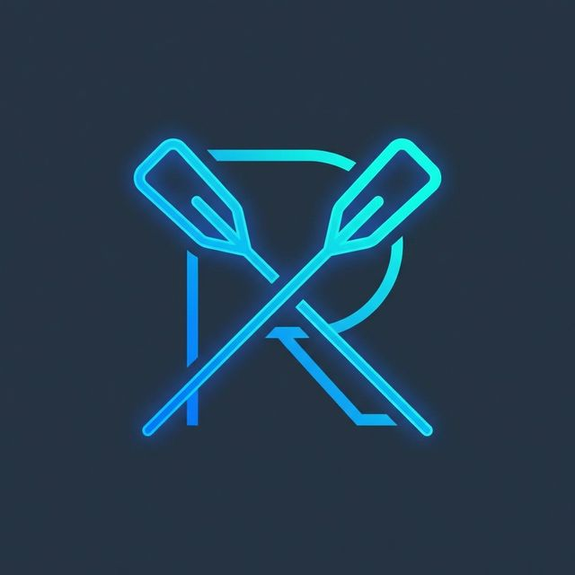
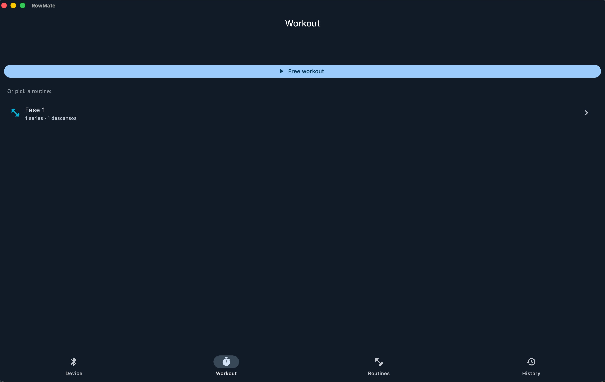
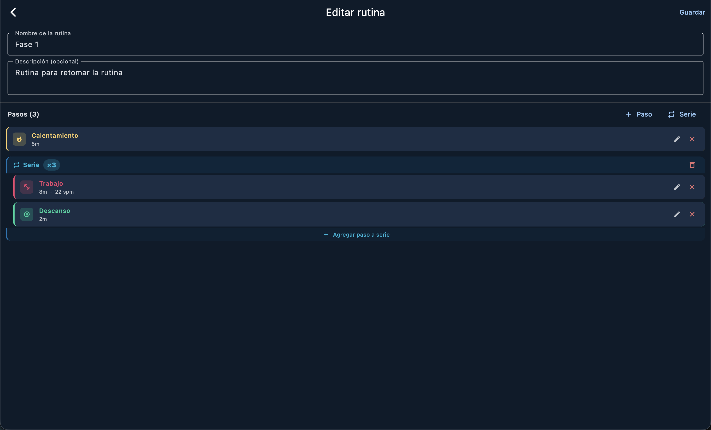
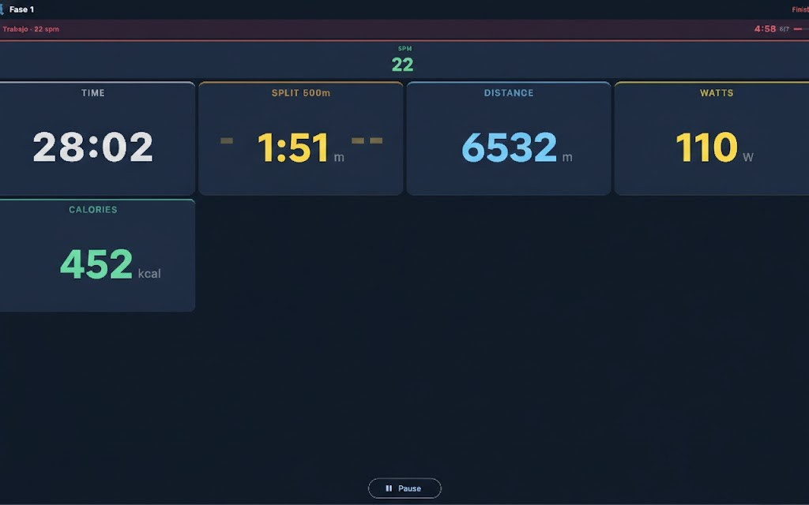
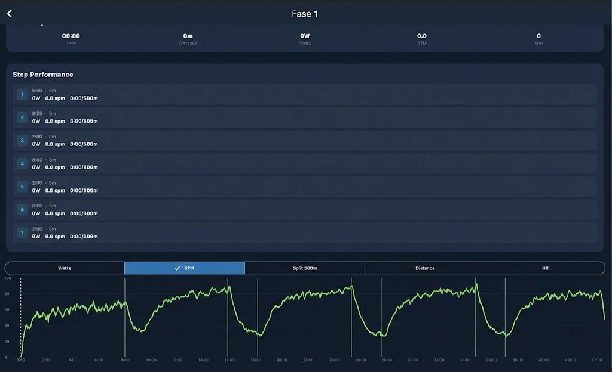
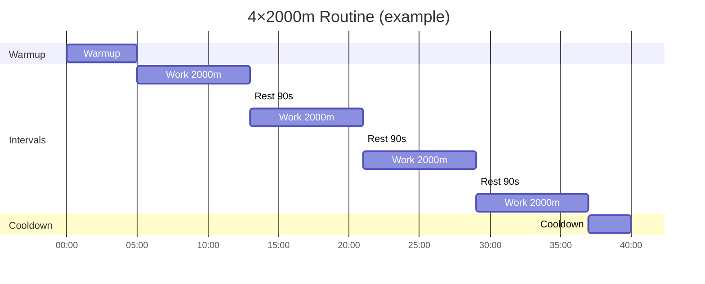

<p align="center">
  
</p>

# RowMate 🚣

**RowMate** is an open-source Flutter app that connects your rowing machine via Bluetooth BLE (using the **FTMS** standard) and helps you manage interval training routines.

> Originally built for the **AMS-670B / Kinomap-XG**, but compatible with **any monitor that implements the FTMS standard**.

---

## Compatible Rowing Machines

RowMate uses the **FTMS (Fitness Machine Service)** protocol — an open Bluetooth SIG standard. If your rowing machine has BLE and supports FTMS, it should work.

| Monitor | Status |
|---------|--------|
| AMS-670B / Kinomap-XG | ✅ Tested |
| Sunny Health & Fitness (SF-RW5623, SF-RW5941, etc.) | ✅ Native FTMS |
| Domyos / Decathlon (R500, R900) | ✅ Native FTMS |
| NordicTrack RW700 / RW900 | ⚠️ Partial |
| WaterRower (with BLE module) | ⚠️ Model dependent |
| Generic BLE rowing machines "FTMS compatible" | ✅ Likely |
| Concept2 (PM5) | ❌ Proprietary protocol |
| Hydrow / Ergatta | ❌ Proprietary protocol |

> **Tested your rowing machine?** Open an [issue](../../issues) or PR to add it to the list 🙌

---

## Bluetooth Protocol

| Element | UUID |
|---------|------|
| FTMS Service | `0x1826` |
| Rower Data (notifications) | `0x2AD2` |

Parsed metrics: **Split /500m · SPM · Watts · Distance · Calories · Heart Rate**

---

## Features

- 📡 **BLE scan and auto-reconnect** — connects and recovers from drops automatically
- 📊 **Real-time metrics** — split, SPM, watts, distance, BPM
- 🏋️ **Training routines** — configurable intervals by time or distance
- 🎯 **Targets** — optional watts and SPM goals per step
- 📈 **Session history** — with detailed telemetry and per-step breakdown
- 🔒 **Screen always-on** during workouts
- 🔄 **Strava integration** — upload sessions, sync activities, track sync status

---

## Screenshots








---

## Project Structure

```
lib/
├── core/
│   ├── bluetooth/
│   │   ├── ble_service.dart       # BLE connection + subscriptions
│   │   └── ftms_parser.dart       # 0x2AD2 characteristic parser
│   ├── database/
│   │   └── database_service.dart  # SQLite (sqflite)
│   ├── models/
│   │   ├── rowing_data.dart        # Real-time metrics
│   │   ├── routine.dart            # Training routine
│   │   ├── interval_step.dart      # Individual step (work/rest)
│   │   └── workout_session.dart    # Saved session + DataPoints
│   └── strava/
│       ├── strava_config.dart      # API URLs and constants
│       ├── strava_secrets.dart     # Credentials (gitignored)
│       ├── strava_auth_service.dart # OAuth2 login/logout/refresh
│       ├── strava_api_service.dart  # Upload, sync, activity streams
│       └── tcx_builder.dart        # TCX XML generator for uploads
├── features/
│   ├── device/        # BLE scan + connection
│   ├── workout/       # Live workout with routine tracking
│   ├── routines/      # Routine CRUD + step editor
│   ├── history/       # Session history
│   └── profile/       # Strava connection + upload settings
└── shared/
    ├── theme.dart
    └── widgets/
```

---

## Quick Start

### Requirements

- [Flutter SDK](https://docs.flutter.dev/get-started/install) ≥ 3.3.0
- Android (API 21+), iOS device, or macOS

### Clone and install

```bash
git clone https://github.com/figuibeh/rowmate.git
cd rowmate
flutter pub get
```

### Run

```bash
# Android (with connected device or emulator)
flutter run

# macOS desktop
flutter run -d macos

# List available devices
flutter devices
```

---

## Strava Integration (optional)

RowMate can upload your rowing sessions to Strava and sync activities from other devices. **Strava is completely optional** — the app works fully offline without it.

### Setup

1. Go to [developers.strava.com](https://developers.strava.com) and log in with your Strava account
2. Click **Create & Manage Your App** → **Create an App**
3. Fill in the form:
   - **Application Name**: `RowMate` (or any name)
   - **Category**: `Training`
   - **Club**: leave empty
   - **Website**: any URL (e.g. `https://github.com/figuibeh/rowmate`)
   - **Authorization Callback Domain**: `rowmate`
4. Once created, copy your **Client Secret** from the app settings
5. In the project, copy the example secrets file and fill in your secret:

```bash
cp lib/core/strava/strava_secrets.dart.example lib/core/strava/strava_secrets.dart
```

6. Edit `lib/core/strava/strava_secrets.dart`:

```dart
const stravaClientId = '205302';           // RowMate's public client ID
const stravaClientSecret = 'YOUR_SECRET';  // paste your secret here
```

> The `client_id` (`205302`) is RowMate's registered app ID on Strava — it's public and shared across all users. The `client_secret` is personal and **must not be committed to git**.

### Features

- **Upload to Strava**: bulk-upload all unsynced local sessions with one tap
- **Auto-upload**: sessions upload to Strava automatically after finishing (configurable)
- **Ask each time**: shows a dialog after each workout
- **Manual upload**: upload individual sessions from the session detail screen
- **Sync from Strava**: download your rowing activities from Strava to the local history
- **Sync status**: each session in history shows a Strava icon indicating sync status
- **Session auto-repair**: sessions that didn't save properly (e.g. app closed mid-workout) are automatically repaired from telemetry data before uploading
- **Duplicate detection**: re-uploading an already synced session links to the existing Strava activity instead of creating a duplicate

---

## Platform Notes

### Android
- `minSdkVersion 21` required
- BLE permissions already configured in `AndroidManifest.xml`

### iOS
- Physical device required (Bluetooth doesn't work on simulator)
- Bluetooth permissions already set in `Info.plist`

### macOS
- Works out of the box, no extra configuration needed

---

## Routines & Interval Steps

A **routine** is a sequence of steps. Each step has a type, a duration (by time or distance), and optional performance targets.

| Step Type | Color | Description |
|-----------|-------|-------------|
| Warmup | 🟡 Yellow | Easy opening phase |
| Work | 🔴 Red | Effort interval |
| Rest | 🟢 Green | Recovery |
| Cooldown | 🔵 Blue | Easy closing phase |

Each step is configured **by time** (min:sec) or **by distance** (meters), with optional **watts** and **SPM** targets that highlight in red during the workout if you fall short.

### Building a Series

You can stack steps to build full training series. A typical interval session looks like this:

```
Warmup (5 min)
  Work (2 min @ 150W+) ─┐
  Rest (1 min)          ├─ repeat × N
  Work (2 min @ 150W+) ─┘
  ...
Cooldown (3 min)
```

Example: a **4×2000m** pyramid might be:



Each step in the editor can have an individual watts/SPM target, so the app warns you in real time when you drop below your goal.

---

## Contributing

Contributions are welcome! If you have a compatible rowing machine not on the list, or want to add metrics / features, open an issue or a PR.

See [CONTRIBUTING.md](./CONTRIBUTING.md) for guidelines.

---

## License

[MIT](./LICENSE) © 2026 iguisoft
